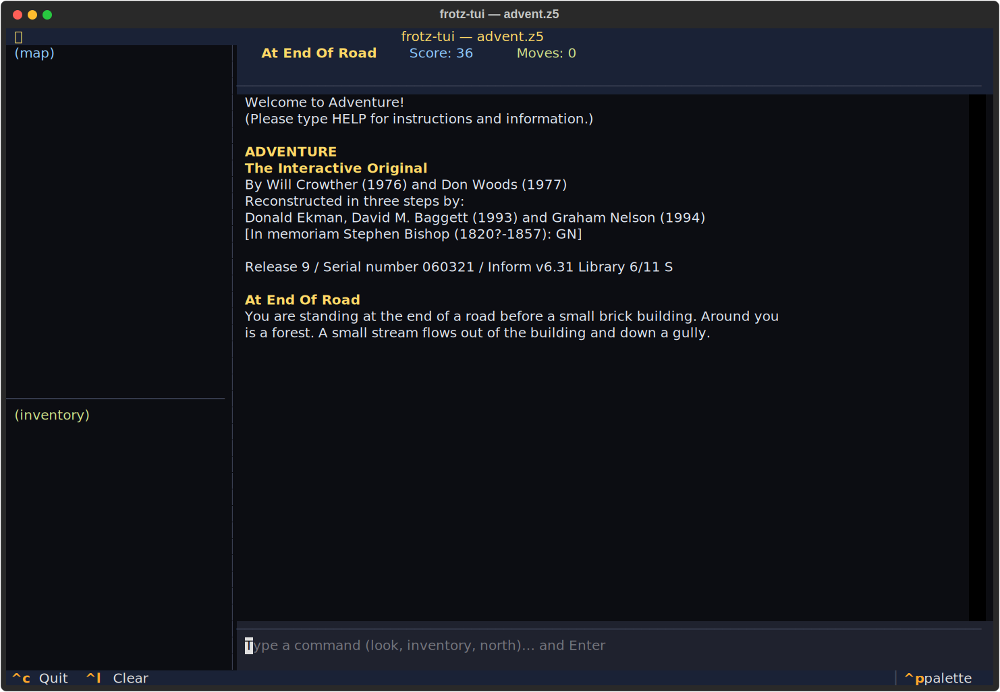
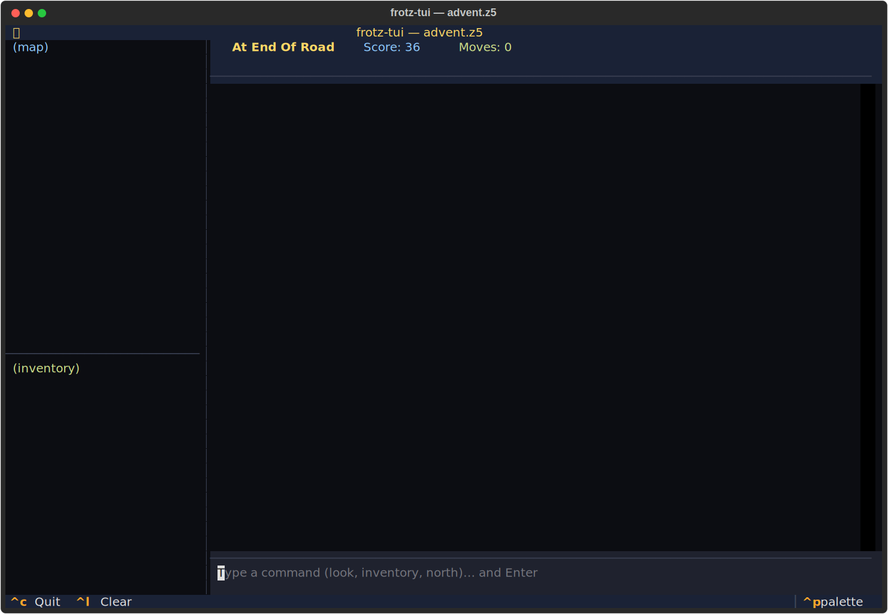

# frotz-tui
You are likely to be eaten by a grue.




## About
Infocom's Z-machine lives on — now wrapped in a modern Textual shell with transcript, inventory and auto-built map panes. Ships with the freely-redistributable Advent.z5: 'You are standing at the end of a road before a small brick building.' Forty-plus years old. Still the purest adventure engine ever cut.

## Screenshots


## Install & Run
```bash
git clone https://github.com/akakabrian/frotz-tui
cd frotz-tui
make
make run
```

## Controls
<Add controls info from code or existing README>

## Testing
```bash
make test       # QA harness
make playtest   # scripted critical-path run
make perf       # performance baseline
```

## License
GPL-3.0

## Built with
- [Textual](https://textual.textualize.io/) — the TUI framework
- [tui-game-build](https://github.com/akakabrian/tui-foundry) — shared build process
